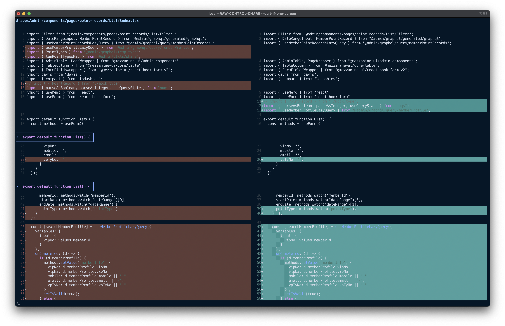
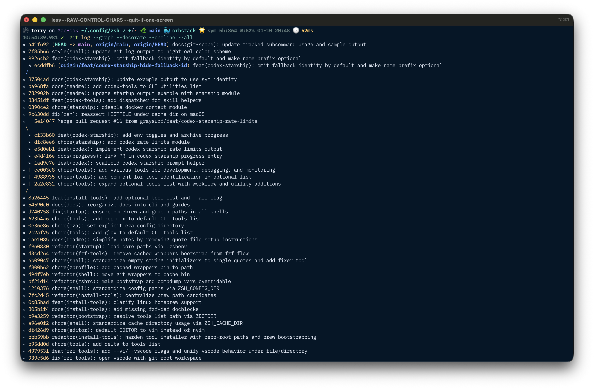
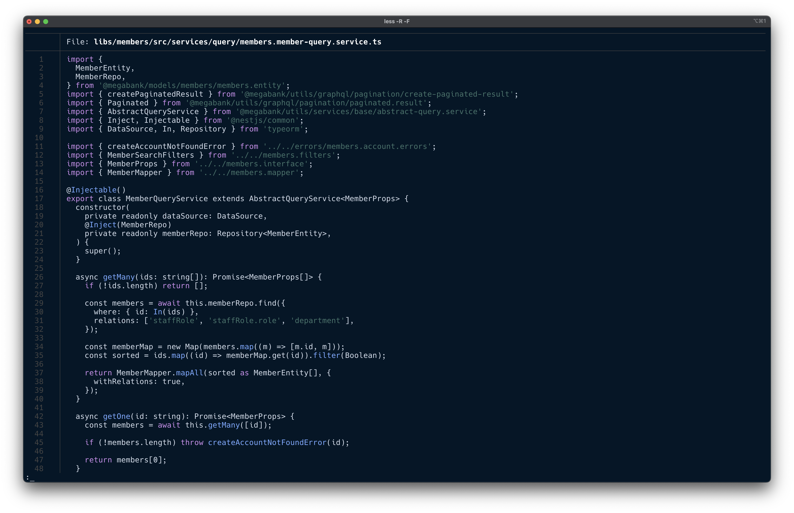
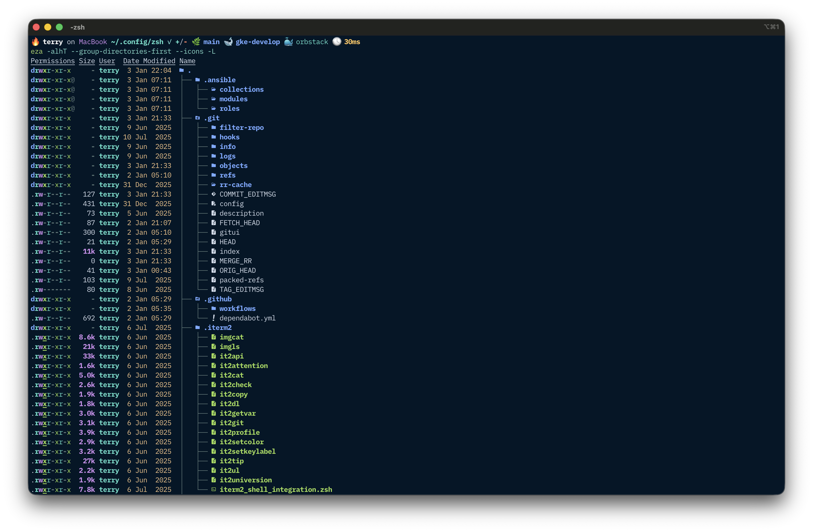
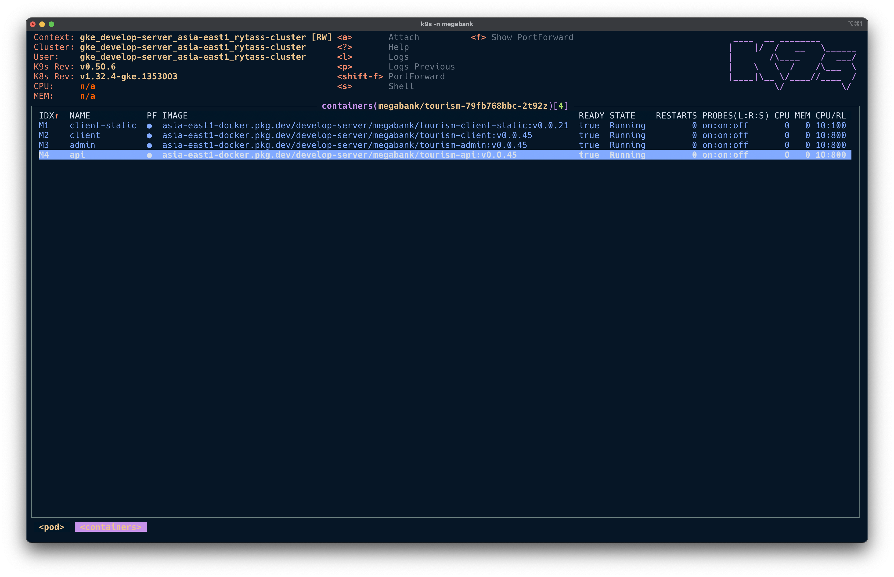
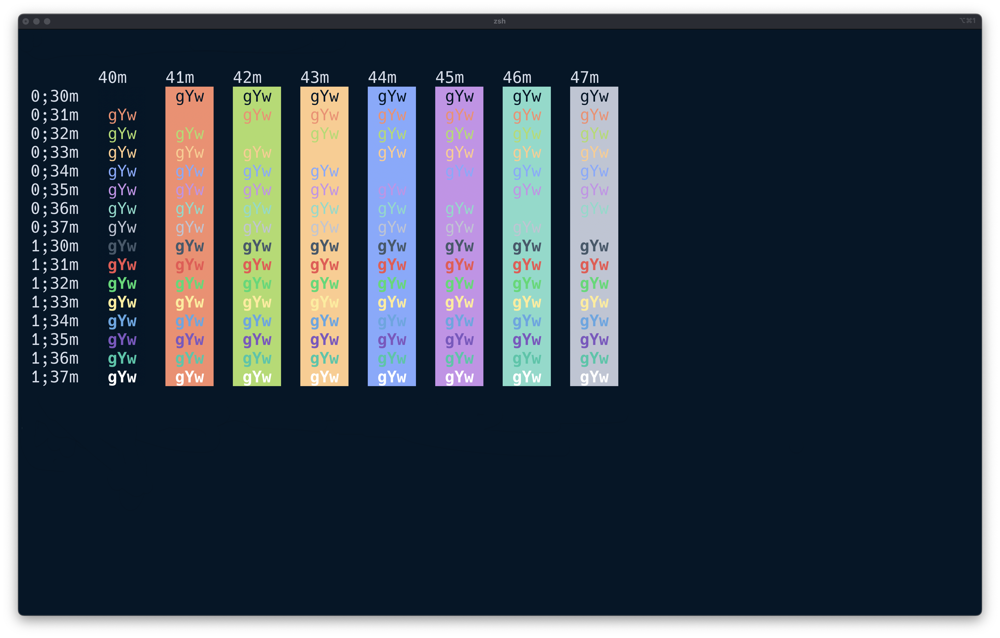
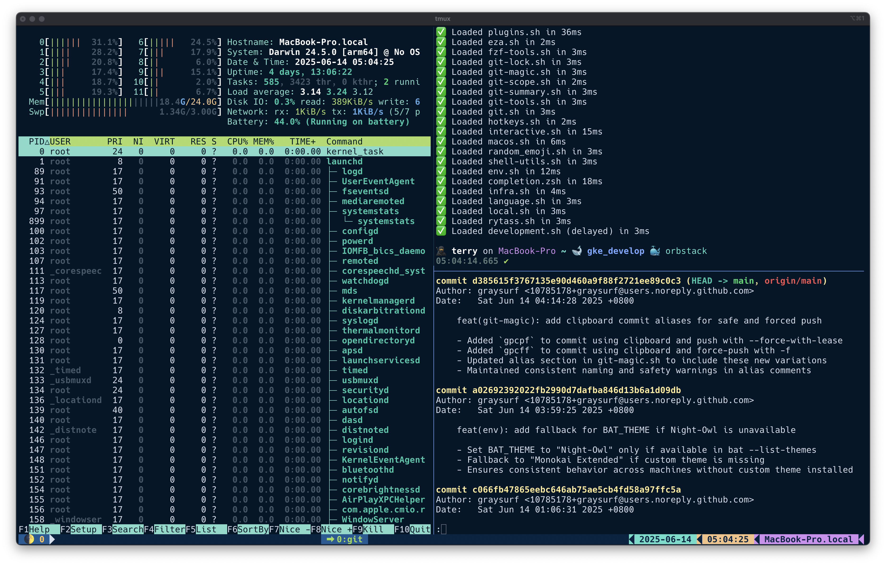
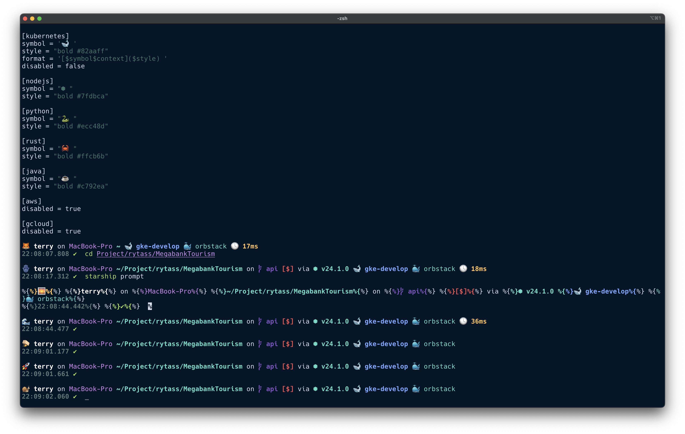

# 🌙 Night Owl CLI Theme Suite

A fully synchronized CLI color theme based on the famous **Night Owl** palette, redesigned for **low-light, high-focus terminal environments**.

This project brings Night Owl's signature cool tones and soft contrasts to your favorite command-line tools, including:

- 🐙 `delta` – Git diff viewer
- 🌳 `git` – log/branch colors
- 🐱 `bat` – Syntax-highlighting cat replacement
- 🦉 `eza` – Modern `ls` replacement
- 🛁 `k9s` – Kubernetes TUI client
- 🧬 `fzf` – Fuzzy finder with preview integration
- 🔮 `iterm2` – Terminal emulator color scheme
- 🧪 `tmux` – Status line and pane border theming
- 🚀 `starship` – Minimal prompt with semantic color cues

## 🎯 Philosophy

> Night Owl is more than a theme — it’s a workspace ritual.

- Optimized for **focus** and **clarity** in low-light environments
- Reduces eye strain without sacrificing syntax readability
- Carefully selected saturation and brightness levels per tool

## 📁 Directory Structure

```text
night-owl-cli/
│
├── delta/
│   └── night-owl-delta.ini
├── git/
│   └── night-owl-colors.gitconfig
├── bat/
│   └── Night-Owl.tmTheme
├── eza/
│   └── night-owl.yml
├── k9s/
│   └── night-owl.yaml
├── fzf/
│   └── fzf-night-owl.zsh
├── iterm2/
│   └── Night-Owl.itermcolors
├── tmux/
│   └── .tmux.conf
├── starship/
│   ├── starship.toml
│   └── random_emoji_cmd.sh
│
└── install.sh
```

## 🔧 Setup Instructions

### 🔹 Quick Start (Optional)

A helper script is available for auto-installation of supported components:

```bash
./install.sh
```

This script:

- Installs each theme **only if the related tool is installed**
- Backs up your config file if it already exists
- Symlinks or copies the Night Owl config into proper location

> ⚠️ If you already have custom config for any tool, **review and merge manually**.
> Do **not run blindly** unless you're fully aware of the changes.

When in doubt: **install one tool at a time by following the steps below.**

---

### 🐙 delta

1. Copy `delta/night-owl-delta.ini` to `~/.config/delta/themes/night-owl.ini`
2. In `~/.gitconfig`, include the theme config:

   ```ini
   [include]
       path = ~/.config/delta/themes/night-owl.ini

   [delta]
       syntax-theme = "Night-Owl"
       features = "night-owl"
   ```

> ✅ **Note:** Do **not** manually copy the `[delta "night-owl"]` block into `~/.gitconfig`.
> Use `[include]` instead to ensure full compatibility with delta's features mechanism.



---

### 🌳 git

1. Copy `git/night-owl-colors.gitconfig` to `~/.config/git/night-owl-colors.gitconfig`
2. In `~/.gitconfig`, include the config:

   ```ini
   [include]
       path = ~/.config/git/night-owl-colors.gitconfig
   ```

3. Try:

   ```bash
   git log --graph --decorate --oneline --all
   ```



---

### 🐱 bat

1. Copy `bat/Night-Owl.tmTheme` to `~/.config/bat/themes/`
2. Run: `bat cache --build`
3. Set theme: `export BAT_THEME="Night-Owl"`



---

### 🦉 eza

1. Copy `eza/night-owl.yml` to `~/.config/eza/theme.yml`
2. Set config directory (e.g. in your `.zshrc` / `.bashrc`):

   ```sh
   export EZA_CONFIG_DIR=~/.config/eza
   ```



---

### 🛁 k9s

1. Copy `k9s/night-owl.yaml` to `~/.k9s/skins/night-owl.yaml`
2. In `~/.k9s/config.yaml`:

   ```yaml
   k9s:
     skin: night-owl
   ```



---

### 🧬 fzf

1. Source the file in your `.zshrc`:

   ```sh
   source "$ZDOTDIR/tools/fzf-night-owl.zsh"
   ```


---

### 🔮 iterm2

1. Go to `Preferences → Profiles → Colors → Color Presets... → Import...`
2. Select `iterm2/Night-Owl.itermcolors`
3. Apply the theme from the Presets dropdown



---

### 🧪 tmux

1. Source `tmux/.tmux.conf` or merge into your own `.tmux.conf`
2. Reload: `tmux source-file ~/.tmux.conf`



---

### 🚀 starship

1. Replace or merge into `~/.config/starship.toml`
2. Place `random_emoji_cmd.sh` at `~/.config/zsh/tools/random_emoji_cmd.sh`  
   (or update the path in `starship.toml` if you use a different location)

> This script generates a random emoji for each prompt refresh 🎲  
> Don’t forget to `chmod +x` it!



---

## 🗑️ Uninstall Instructions

To remove all installed Night Owl configurations, run:

```bash
  ./uninstall.sh
```

This will:

- Remove all Night Owl theme/config files installed by install.sh
- Restore any .bak backups that were created during installation

To preview what would be removed without making changes:

```bash
  ./uninstall.sh --dry-run
```

⚠️ iTerm2 color presets must be removed manually:
  Preferences → Profiles → Colors → Color Presets... → Remove 'Night Owl'

⚠️ If you added a Git `[include] path = ~/.config/git/night-owl-colors.gitconfig`, remove it manually.

This script only affects files created by install.sh. If you've merged configs manually,
please review them before running uninstall.

## ✅ Licensing

MIT License. Theme color values adapted from [Night Owl VSCode theme](https://github.com/sdras/night-owl-vscode-theme) by Sarah Drasner.

This project is a CLI-oriented adaptation for personal and community use.

---

*Contributions welcome. Pull requests for additional tool integrations or refinements appreciated.*
